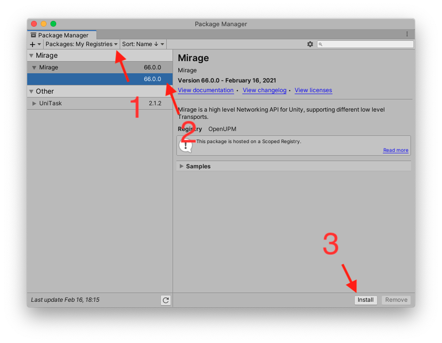

[](https://miragenet.github.io/Mirage/)
[](https://discordapp.com/invite/DTBPBYvexy)
[](https://github.com/MirageNet/Mirage/releases/latest)
[](https://openupm.com/packages/com.miragenet.mirage/)
[](https://github.com/MirageNet/Mirage/actions/workflows/main.yml)

## What is Mirage?

Mirage is a high-level networking library for Unity. It's modular, performant, and designed to be easy to use, whether you're building an MMO, a co-op game, or an FPS.

Mirage is battle-tested in released games and built with security in mind, with many tools to help prevent multiplayer exploits.

Mirage is open source. Bug reports and feedback are welcome, either open an issue on Github or join the Discord.

## Quick Look

```csharp
// Server/Client events — listen from anywhere, no central manager needed
public class GameSetup : MonoBehaviour
{
    public NetworkServer Server;
    public NetworkClient Client;

    private void Awake()
    {
        Server.Authenticated.AddListener(OnPlayerJoined);
        Server.Disconnected.AddListener(OnPlayerLeft);
        Client.Authenticated.AddListener(OnConnected);
    }

    private void OnPlayerJoined(INetworkPlayer player) { /* spawn logic */ }
    private void OnPlayerLeft(INetworkPlayer player) { /* cleanup logic */ }
    private void OnConnected(INetworkPlayer player) { /* client ready */ }
}

// NetworkBehaviour — SyncVars, RPCs, and Identity events
public class PlayerCombat : NetworkBehaviour
{
    [SyncVar]
    public int health = 100;

    private void Awake()
    {
        Identity.OnStartServer.AddListener(OnStartServer);
    }

    private void OnStartServer() { /* server-side init */ }

    [ServerRpc]
    // Rate limit to block spam
    [RateLimit(Refill = 1, MaxTokens = 5, Penalty = 10)]
    public void CmdAttack(NetworkIdentity target)
    {
        // validate and apply damage
    }

    [ServerRpc]
    [RateLimit(Refill = 1, MaxTokens = 5, Penalty = 50)]
    // return values so client can await result to know if they were successful or not
    public UniTask<bool> CmdBuyItem(int itemId)
    {
        if (!HasEnoughGold(itemId))
            return UniTask.FromResult(false);

        AddItemToInventory(itemId);
        return UniTask.FromResult(true);
    }
}
```

## Installation

To install Mirage, follow these steps:

1) Mirage requires at least Unity 2022 LTS. You may install [Unity 2022 LTS](https://unity.com/) via the Unity website or via the Unity Hub. <br/>
    You may use newer versions, however, _LTS versions are strongly recommended_ as newer versions can contain bugs, glitches, or just flat-out break game projects.
2) Start a new project or open your existing one. If opening an existing one, it is **strongly recommended** to back it up before installing Mirage.
4) Add the OpenUPM registry.  Click on the `Edit` menu, then select `Project settings...`, select `Package Manager`, and add a scoped registry like so: <br/>
    Name: `OpenUPM` <br/>
    Url: `https://package.openupm.com` <br/>
    Scopes:
    - `com.cysharp.unitask`
    - `com.openupm`
    - `com.miragenet`
    - `com.miragenet.mirage`
   
4) Close the project settings.
5) Open the package manager by clicking on the `Window` menu and selecting `Package Manager`. Then select `Packages`, `My Registries`, select the latest version of Mirage and click install, like so:
   
6) You may come back to the package manager at any time to uninstall Mirage or upgrade it.

### Alternative: Install via Git URL

If you prefer to install a specific version or hash directly from GitHub, you can add the following line to your `Packages/manifest.json` file under the `dependencies` section:

```json
"com.miragenet.mirage": "https://github.com/MirageNet/Mirage.git?path=/Assets/Mirage#v156.2.4",
```

## Migrating from Mirror

If you've got a project already using Mirror and you want to migrate it to Mirage, it's recommended to check out our [Migration Guide](https://miragenet.github.io/Mirage/docs/guides/mirror-migration) for a smooth transition. Also check the heading below, as there are some major differences between Mirage and the other network library.

## Comparison with Mirror

Mirage is a hard fork of Mirror, with many added features, performance improvements, and security improvements.

| Mirage                                              | Mirror                                 |
| --------------------------------------------------- | -------------------------------------- |
| Installs via Package Manager (OpenUPM or GitHub URL) | Installs from the Unity Asset Store    |
| Errors are thrown as exceptions                     | Errors are logged                      |
| `[ServerRpc]`                                       | `[Command]`                            |
| `[ClientRpc(target = RpcTarget.Owner)]`             | `[TargetRpc]`                          |
| Events: listen from any script, no central manager  | Override methods: large `NetworkManager` class with single overrides |
| Follows C# code style and conventions               | No consistency                         |
| `NetworkTime` available in `NetworkBehaviour`       | `NetworkTime` is global static         |
| Send any data as messages                           | Messages must implement NetworkMessage |
| Structured SocketLayer with consistent connection flow for all transports | Each transport implements its own connection logic |

**Some notable features that Mirage has:**

* Well-structured codebase — clear boundaries between systems make it easy to navigate and understand
* No static state — multiple server/client instances can run in the same Unity process
* Strict error handling — invalid calls throw exceptions so bugs surface immediately instead of silently corrupting state
* Network Behaviours can be on root or child GameObject
* Server RPCs can [Return Values](https://miragenet.github.io/Mirage/docs/guides/remote-actions/server-rpc)
* [Bit Packing](https://miragenet.github.io/Mirage/docs/guides/bit-packing) to easily optimize network messages and reduce bandwidth
* [Rate Limiting](https://miragenet.github.io/Mirage/docs/guides/remote-actions/rate-limiting) and [Max Length](https://miragenet.github.io/Mirage/docs/guides/attributes#max-length-attribute) validation via attributes
* [Error Flags](https://miragenet.github.io/Mirage/docs/guides/error-handling) to track misbehaving clients and what errors they are causing
* [Version Defines](https://docs.unity3d.com/Manual/ScriptCompilationAssemblyDefinitionFiles.html#define-symbols)
* [Fast Play Mode support](https://blogs.unity3d.com/2019/11/05/enter-play-mode-faster-in-unity-2019-3/)

Mirage is built upon fundamental pillars: 

* Clean, readable codebase that follows C# conventions
* No singletons or global static state
* High test coverage

## Development environment setup

If you want to contribute to Mirage, follow these steps:

### Linux and Mac

1) Ensure git is installed. On Linux, install via your package manager. On macOS, it's included with the Xcode command-line tools.
2) Clone the Mirage repository:
    ```sh
    git clone https://github.com/MirageNet/Mirage.git
    ```
3) Open the cloned repo in Unity 2022.3 LTS or later.

### Windows

1) Install [git](https://git-scm.com/download/win) or use your preferred git client.
2) As an administrator, clone with symbolic links support:
    ```sh
    git clone -c core.symlinks=true https://github.com/MirageNet/Mirage.git
    ```
    If you don't want to use administrator, [add symlink support](https://www.joshkel.com/2018/01/18/symlinks-in-windows/) to your account.
    If you don't enable symlinks, you will be able to work on Mirage but Unity will not see the examples.
3) Open in Unity 2022.3 LTS or later and have fun!

## Transport and Sockets

Mirage supports multiple ways of transporting data:
- Native UDP socket (default on Windows and Linux) with fallback to C# UDP Sockets (default on macOS and other platforms)
- Steam (via [MirageSteamworks](https://github.com/MirageNet/MirageSteamworks))
- Epic Online Services (via [EpicSocket](https://github.com/MirageNet/EpicSocket))
- WebSocket for WebGL clients (via [SimpleWebSocket](https://github.com/James-Frowen/SimpleWebSocket))

## Related Projects

- [MirageStandalone](https://github.com/MirageNet/MirageStandalone) — Run Mirage servers without Unity
- [Mirage.Core](https://github.com/James-Frowen/Mirage.Core) — Core serialization and networking, framework-independent
- [Mirage.Godot](https://github.com/James-Frowen/Mirage.Godot) — Mirage networking for Godot

## Contributing

1. See the Development Environment Setup above.
2. Fork this Mirage repository.
3. Using your new fork, create your feature branch: `git checkout -b my-new-feature`
5. Then commit your changes: `git commit -am 'Add some feature'`
6. Push to the branch: `git push origin my-new-feature`
7. Submit a pull request and let the team review your work. :smiley:

The team will review it ASAP and give it the stamp of approval, ask for changes or decline it with a detailed explanation. 

Thank you for using Mirage and we hope to see your project be successful!
