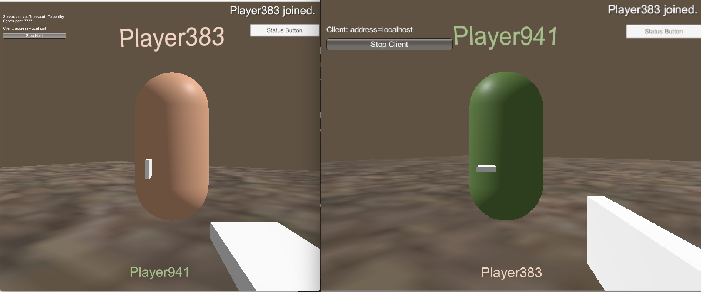

# Mirage Quick Start Guide V0.1

This guide covers the following topics:
- [Installation](#installation)
- [Network Manager GameObject](#creating-a-network-manager)
- [Player Movement](#player-movement)
- [Initiate Server By Scripting](#initiate-server-by-scripting)
- [Network Manager Hud](#understanding-network-hud)
- [Names And Colours](#names-and-colours)
- [Weapon Switching](#weapon-switching)

It is best to first make a mini practice game before converting your single player game, or creating your ideal brand new multiplayer.

The Pre-made Mirage examples are great for using as reference, it is recommend to use them regarding connection setup, with ports and firewalls. This can be a huge topic that changes from person to person, and is not covered in this guide, here we will use localHost (multiple games on same PC).
To achieve this, let's first create a new blank project on Unity Hub, after the editor opened up, we can move forward.

## Installation

Before everything, to install Mirage we need to add a new package manager into our project. To do this, we can go into `Edit menu` then `Project Settings`.
This will open a new Editor Window with multiple tabs. The one we are looking for is `Package Manager`, so click there.
Once you click there, you should add a new Package Manager, so complete the fields as we show next and click apply

```
Name: OpenUPM
Url: https://package.openupm.com
Scopes:
- com.cysharp.unitask
- com.openupm
- com.miragenet
```


Once everything is ready, the next step is to close the Project Settings window, and jump into the `Package Manager`. So for this we click on `Window menu` then `Package Manager`. 
At this window, we will click on a small button that says (probably, at today date on Unity Editor 2021.13f) `Packages: In Project`, here we have to select `My registries`.
Once, you've done that, we should be able to see Mirage and a few transport and also plugins in that list.
After select, you can choose the version on the list below the name, otherwise you can just click install on the bottom right part of the window and after a loading bar, that's it. You already have Mirage API on your code, congrats!


NOTE: Mirage already includes a UDP transport, so for this guide is not necessary download anything else than Mirage.

## Creating A Network Manager

Here we will be following a couple of steps, so it is easier to follow me.

- Right click on your Scenes folder, then click on Create new scene, save it as `Main Scene`, and add it to build settings
- Mirage already have a menu for creating a base network manager, so right click on your Scene hierarchy then go to `Create => Network => NetworkManager`
- Now you will see a pre configured GameObject called `NetworkManager`


Important stuff about this objects
```
    CharacterSpawner is the one will be in charge of spawning your player later, so this is very important object
    Since we are not changing scenes between server open or close, we could disable the NetworkSceneManager, but we can leave it as it is.
    UdpSocketFactory is the one that does the connection, so you can change the IP and port if necessary there.
```

Now let's setup a few things on the scene, to make it look more like a game
- Add a simple Plane floor with: 
    - positions (0, -1, 0)
    - scale (2, 2, 2)
- Next we add a GameObject, name with name `StartPosition1` 
    - set position (1, 1, 1)
- We go back to our `NetworkManager GO`, over `Character Spawner` component we will change the `Player Spawn Method` from Random to Round Robin.
    - As a second step, we will add into the `Start Positions` list the one we created on the previous step.
- (Optional) you can create more positions if you want, and you can add them into the list, is not necessary but maybe looks nice.

## Player Movement

So after we configure the basics, we need to create our player prefab in order to be able to spawn ourself in the network.
As before, we will follow a couple of easy steps.

- Create a capsule in the scene hierarchy and name it Player
- Attached a `NetworkIdentity` and `NetworkTransform` component into the capsule.
- Tick Client Authority on the NetworkTransform

This is how our Player GO components should look right now


NOTE: Is not needed to set anything else here, `Server Object Manager` and `Client Object Manager` will be set dynamically by Mirage later.

Next steps:
- Add a new Script, call it `PlayerScript`
- Then drag this GO with the mouse into the assets folder (You should probably create a Prefabs folder later as a good practice) and release the mouse there. That will create a Prefab for us. (You can notice this was successful because your GO icon in the scene hierarchy will be blue now)
- Then delete Player from scene

At this stage, our player is done, so right now we need to tell Mirage who is our player in order to spawn it.
So this is very easy, just go to your `NetworkManager` GO and open (if it is not) Character Spawner, then drag the player prefab we created before in the `Player Prefab` field.


The last step we will need to do, is simple go to our script we created before (you can go into the assets folder and it will be there) and double click it and it will open your IDE. So what we will need to do is simple tell how we are moving the user, and also to set the camera as child of the player.

We can do that simply like this:
```cs
using Mirage;
using UnityEngine;

namespace GettingStarted
{
    public class PlayerScript : NetworkBehaviour
    {
        private void Awake() {
            Identity.OnStartLocalPlayer.AddListener(OnStartLocalPlayer);
        }

        private void OnStartLocalPlayer()
        {
            Camera.main.transform.SetParent(transform);
            Camera.main.transform.localPosition = new Vector3(0, 0, 0);
        }

        private void Update()
        {
            if (!IsLocalPlayer) { return; }

            float moveX = Input.GetAxis("Horizontal") * Time.deltaTime * 110.0f;
            float moveZ = Input.GetAxis("Vertical") * Time.deltaTime * 4f;

            transform.Rotate(0, moveX, 0);
            transform.Translate(0, 0, moveZ);
        }
    }
}
```

Press play in Unity editor and... what happen? Why is our player don't spawning? 
Well, the question is very simple. You need to start the server somehow, and that's what comming next, but before...

### Types of servers

On Mirage has two types of server:
- You can create a server only game, which runs as an Authoritative kind, and takes decision for every player and you must join always as a client ([For more info you can click here](https://www.gabrielgambetta.com/client-server-game-architecture.html)).
- You can create a host server. Which will work as client + server and will take decisions for every other clients in the network

Which one is the best? That depends on your game, we can't know certainly in this guide.

### Why are you telling me this now?

Because in this guide we will be working on Server + Client type, so we want you to know that there are other ways to connect into the Server besides this guide.

### Continuing with the guide

Now, we need to connect into our server, so for this we have two roads, write down a script and make the server start or just using the HUD

## Initiate Server By Scripting

This one is pretty simple, we just need to go to our `NetworkManager` GO then

- Create a new script, we can call it `StartServer`
- Then server starts should look like this:

```cs
using Mirage;
using UnityEngine;

namespace GettingStarted
{
    public class StartServer : MonoBehaviour
    {
        [SerializeField] private NetworkManager networkManager;

        private void Start() 
        {
            if (!networkManager) { return; }
            
            networkManager.Server.StartServer(networkManager.Client);
        }
    }
}
```

After we save the file, we go back into our `NetworkManager` GO, and assign the NetworkManager field into the script.


## Understanding Network Hud

TODO

> [!WARNING] 
> From here: This guide was written for mirror so some information might be out-of-date for mirage

## Names And Colours

Player name above heads
- Inside your player Prefab, create an empty GameObject
- name it something like `FloatingInfo`
    - position Y to 1.5 
    - scale X to -1
- Inside that `FloatingInfo`, create a 3D text using Unity menu (GameObject - 3D Object - 3D Text),
- Set it up as shown in the picture below


Update your PlayerScript.cs with this:
```cs
using Mirage;
using UnityEngine;

namespace QuickStart
{
    public class PlayerScript : NetworkBehaviour
    {
        public TextMesh playerNameText;
        public GameObject floatingInfo;

        private Material playerMaterialClone;

        [SyncVar(hook = nameof(OnNameChanged))]
        public string playerName;

        [SyncVar(hook = nameof(OnColorChanged))]
        public Color playerColor = Color.white;

        [ServerRpc]
        public void CmdSetupPlayer(string _name, Color _col)
        {
            // player info sent to server, then server updates sync vars which handles it on all clients
            playerName = _name;
            playerColor = _col;
        }

        private void Awake() {
            Identity.OnStartLocalPlayer.AddListener(OnStartLocalPlayer);
        }

        private void OnStartLocalPlayer()
        {
            Camera.main.transform.SetParent(transform);
            Camera.main.transform.localPosition = new Vector3(0, 0, 0);
            
            floatingInfo.transform.localPosition = new Vector3(0, -0.3f, 0.6f);
            floatingInfo.transform.localScale = new Vector3(0.1f, 0.1f, 0.1f);

            string name = "Player" + Random.Range(100, 999);
            Color color = new Color(Random.Range(0f, 1f), Random.Range(0f, 1f), Random.Range(0f, 1f))
            CmdSetupPlayer(name, color);
        }

        private void OnNameChanged(string _Old, string _New)
        {
            playerNameText.text = playerName;
        }

        private void OnColorChanged(Color _Old, Color _New)
        {
            playerNameText.color = _New;
            playerMaterialClone = new Material(GetComponent<Renderer>().material);
            playerMaterialClone.color = _New;
            GetComponent<Renderer>().material = playerMaterialClone;
        }

        private void Update()
        {
            if (!IsLocalPlayer)
            {
                // make non-local players run this
                floatingInfo.transform.LookAt(Camera.main.transform);
                return;
            }

            float moveX = Input.GetAxis("Horizontal") * Time.deltaTime * 110.0f;
            float moveZ = Input.GetAxis("Vertical") * Time.deltaTime * 4f;

            transform.Rotate(0, moveX, 0);
            transform.Translate(0, 0, moveZ);
        }
    }
}
```

Add the `PlayerNameText` and `FloatingInfo` objects into the script on the player prefab, as shown below.


Now if you build and run, host on one, join on the other, you will see player names and colors synced across the network! 

Well done, 5 stars to you!


## Part 11

A scene networked object all can access and adjust.

Create a SceneScript.cs, add it onto an empty GameObject in the scene called SceneScript.

Then create a Canvas with text and button, similar to below.


Add the sceneScript variable, Awake function, and CmdSendPlayerMessage to PlayerScript.cs
Also add the new playerName joined line to CmdSetupPlayer();
```cs
private SceneScript sceneScript;

void Awake()
{
    //allow all players to run this
    sceneScript = GameObject.FindObjectOfType<SceneScript>();
    Identity.OnStartLocalPlayer.AddListener(OnStartLocalPlayer);
}
[ServerRpc]
public void CmdSendPlayerMessage()
{
    if (sceneScript) 
    { 
        sceneScript.statusText = $"{playerName} says hello {Random.Range(10, 99)}";
    }
}
[ServerRpc]
public void CmdSetupPlayer(string _name, Color _col)
{
    //player info sent to server, then server updates sync vars which handles it on all clients
    playerName = _name;
    playerColor = _col;
    sceneScript.statusText = $"{playerName} joined.";
}
public void OnStartLocalPlayer()
{
    sceneScript.playerScript = this;
    //. . . . ^ new line to add here
```

Add this code to SceneScript.cs

```cs
using Mirage;
using UnityEngine;
using UnityEngine.UI;

namespace QuickStart
{
    public class SceneScript : NetworkBehaviour
    {
        public Text canvasStatusText;
        public PlayerScript playerScript;

        [SyncVar(hook = nameof(OnStatusTextChanged))]
        public string statusText;

        void OnStatusTextChanged(string _Old, string _New)
        {
            //called from sync var hook, to update info on screen for all players
            canvasStatusText.text = statusText;
        }

        public void ButtonSendMessage()
        {
            if (playerScript != null)  
            {
                playerScript.CmdSendPlayerMessage();
            }
        }
    }
}
```


- Attach the ButtonSendMessage function to your Canvas Button.
- Attach Canvas Scene Text to SceneScript variable.
    - ignore SceneScript’s, playerScript variable, it automatically sets this!

 


Now if you build and run, host and join, you can send messages, and have a text log for actions!

Wahooo!


Experiment and adjust, have fun!


## Weapon Switching

Weapon switching! The code bits.

Add the following to your PlayerScript.cs
```cs
private int selectedWeaponLocal = 1;
public GameObject[] weaponArray;

[SyncVar(hook = nameof(OnWeaponChanged))]
public int activeWeaponSynced;

void OnWeaponChanged(int _Old, int _New)
{
    // disable old weapon
    // in range and not null
    if (0 < _Old && _Old < weaponArray.Length && weaponArray[_Old] != null)
    {
        weaponArray[_Old].SetActive(false);
    }
    
    // enable new weapon
    // in range and not null
    if (0 < _New && _New < weaponArray.Length && weaponArray[_New] != null)
    {
        weaponArray[_New].SetActive(true);
    }
}

[ServerRpc]
public void CmdChangeActiveWeapon(int newIndex)
{
    activeWeaponSynced = newIndex;
}

void Awake() 
{
    // disable all weapons
    foreach (var item in weaponArray)
    {
        if (item != null)
        { 
            item.SetActive(false); 
        }
    }
}
```
Add the weapon switch button in update. Only local player switches its own weapon, so it goes below the `!isLocalPlayer` check.
```cs
void Update()
{
    if (!IsLocalPlayer)
    {
        // make non-local players run this
        floatingInfo.transform.LookAt(Camera.main.transform);
        return;
    }

    float moveX = Input.GetAxis("Horizontal") * Time.deltaTime * 110.0f;
    float moveZ = Input.GetAxis("Vertical") * Time.deltaTime * 4f;

    transform.Rotate(0, moveX, 0);
    transform.Translate(0, 0, moveZ);

    if (Input.GetButtonDown("Fire2")) //Fire2 is mouse 2nd click and left alt
    {
        selectedWeaponLocal += 1;

        if (selectedWeaponLocal > weaponArray.Length) 
        {
            selectedWeaponLocal = 1; 
        }

        CmdChangeActiveWeapon(selectedWeaponLocal);
    }
}
```

Weapon models

Add the basic cube weapons first, change these later.

- Double click your player prefab to enter it
- Add a "WeaponsHolder" empty GameObject, with position and rotation at 0,0,0.
- Inside that GameObject, create a cube from unity menu, (GameObject, 3D object, cube)- Remove the box colliders.
- Rename this `Weapon1`, change position and scale to match the below pictures.


Duplicate weapon 1 for a Weapon 2, and change its scale and position, now you should have 2 different looking ‘weapons’!


## Part 14

Weapon switch finale.

- Add these 2 GameObjects to your PlayerScript.cs weapons array.
- Disable weapon 2, so only weapon 1 shows when spawning.


Build and run!

You should see each player switching weapons, and whatever your player has equipped, will auto show on new joining players (sync var and hook magic!)



