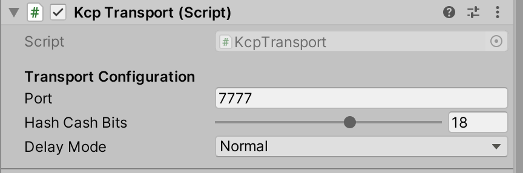

# Kcp Transport

KCP is the default transport in MirrorNG

Simple, message based, MMO Scale UDP networking in C\#.

- KCP is fast and extremely reliable, designed for [MMO](https://assetstore.unity.com/packages/templates/systems/ummorpg-51212) scale Networking.  
- KCP is 100% C#. No native code means it works in all platforms (except webgl)
- KCP features DoS prevention with an algorithm based on [HashCash](http://www.hashcash.org/).
- KCP features CRC64, which makes it virtually impossible for accidental data corruption.
- KCP scales to really large amounts of clients (we tested 800 but it should do a lot more than that).
- KCP is a well known algorithm that provides [reliability and low latency](https://github.com/skywind3000/kcp/blob/master/README.en.md)
- KCP sends and receives data without allocations.
- KCP is lightweight, in my old I3 6300, a server with 800 clients used less than 20% of one core and less than 200MB of RAM.

# Settings

### Port
chose the port the server will listen to
### Hash Cash Bits
Choose how much work clients need to do to connect to your server.  Higher numbers mean it takes longer to connect, which makes it harder to perform a DoS attack on your server. If it is too high, you might annoy your users.
### Delay Mode
Chose normal for lowest bandwidth and CPU usage. Chose Fast3 for lowest latency.