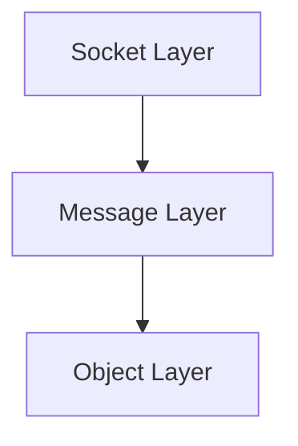
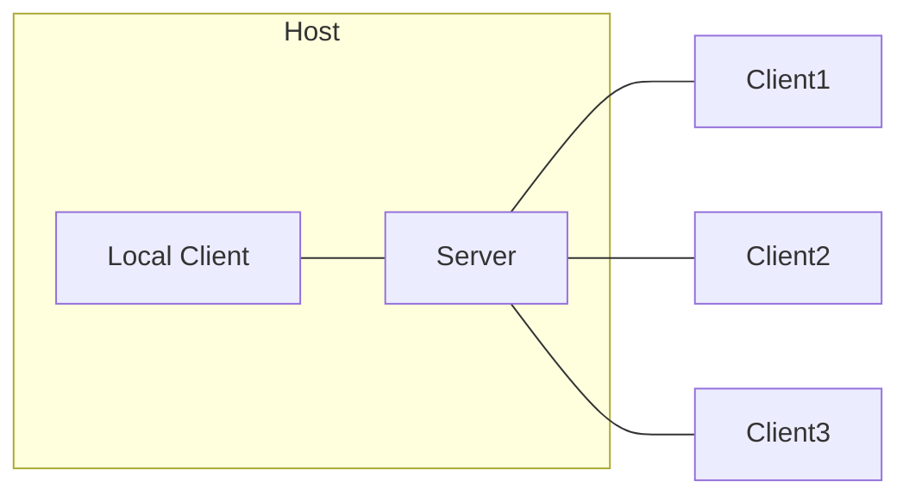

# Overview

Mirage is a high-level multiplayer library for Unity games. The goal is to make it as easy as possible to add multiplayer to your game.

Some of the key features of Mirage include:
* Sending and receiving messages
* State synchronization
* Client/Server and host mode

Mirage is made of 3 layers:

## Socket Layer

The `Socket Layer` is concerned about sending and receiving bytes. It does not know what it is sending. There are several socket factory implementations. The default socket factory in Mirage is UDPSocketFactory. 

If you want to implement a socket factory, create a class that extends `Mirage.SocketLayer.SocketFactory`. Its primary responsibility is to send and receive data. You will also need to create a class that represents a link between Mirage and the outside world by implementing `Mirage.SocketLayer.ISocket`. Reliability is handled on top of the factory by Mirage.

## Message Layer

The message layer is concerned with sending and receiving [messages](/docs/guides/remote-actions/network-messages).

If you wish to use this functionality, you will need to have a `Mirage.NetworkClient` in the client and a `Mirage.NetworkServer` for the server. These classes provide events you can subscribe to for the life cycle of connections. A connection is an implementation of `Mirage.INetworkPlayer`, and can send and receive messages. 

## Object Layer

This layer is the highest level layer,  the classes in this layer are concerned about [synchronizing state](/docs/guides/sync/) between objects, as well as sending [RPC calls](/docs/guides/remote-actions/).

The client needs a `Mirage.ClientObjectManager`, the server needs a `Mirage.ServerObjectManager`. It will spawn and destroy objects and keep the objects in the client in sync with the objects in the server

# Clients and Servers 

Mirage supports 2 modes of operation which can work at the same time.

## Host mode

In host mode,  the server and client are running in the same application and share all networked objects. 
There is a direct in-memory channel of communication between the `Mirage.NetworkServer` and `Mirage.NetworkClient`. 
Since the objects are shared, there is no need to synchronize data. 

Note that the host mode bypasses the Transport Layer.

## Client / Server mode

In this mode,  the client is connected to a separate server, which is normally in another machine and reachable through the network.

In client/server mode, the objects are duplicated in the server and client. For every networked object in the server, there is a corresponding object in the client with a matching network id.

Note a server can be in both host mode as well as a server for other clients.

