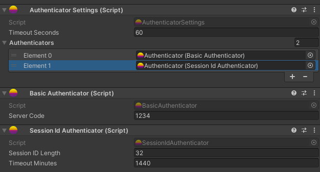
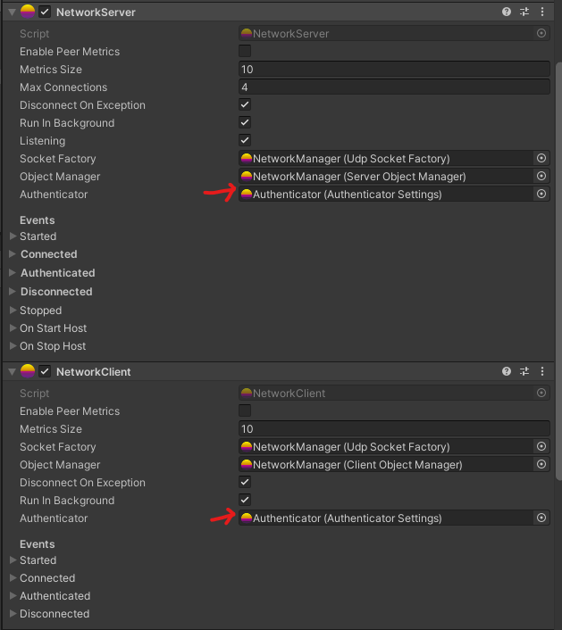

# Authenticator Settings

Add `AuthenticatorSettings` to your `NetworkManager` and assign a reference to `NetworkServer` and `NetworkClient`.

AuthenticatorSettings allows you to configure the timeout duration and specify which authenticators are available.

### Server Side

The list of authenticators on the server represents the options available for client authentication. Clients can choose any of these authenticators to become authenticated.

To determine which authenticator the player used, you can check the `NetworkPlayer.Authentication.Authenticator` property.

### Client Side

On the client side, you need to use the `SendAuthentication` method provided by the authenticator to send a message to the server. This is necessary because most authenticators require additional information, such as player login details.

The `SendAuthentication` method ensures that the authentication message is properly wrapped and sent to the server. It should be used instead of directly calling `player.Send`, as the authenticator message is wrapped in an internal `AuthMessage` message.

However, it's important to note that authenticators typically should not call the `SendAuthentication` method automatically themselves. Instead, you can create an additional component, such as the `CreateSession` component for the `SessionIdAuthenticator` class, to handle the automatic invocation of `SendAuthentication`.

The `CreateSession` component can be responsible for initiating the authentication process and automatically calling the `SendAuthentication` method when needed. This allows the authenticator to automatically use the session token provided by the server for seamless reconnection. Keep in mind that it is recommended to use only one authenticator with this automatic behavior, as the server processes only one authentication per player.

By separating the responsibility of calling `SendAuthentication` to an extra component, you can have more flexibility and control over the authentication flow, while ensuring that authenticators focus on their core functionality.
