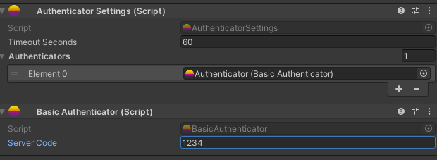

# Basic Authenticator

Mirage includes a Basic Authenticator in the Mirage/Authenticators folder, which provides a simple authentication mechanism using a server code.

To use the Basic Authenticator, follow the setup steps described in the [Authenticator Settings](./authenticator-settings.md) page.

After performing these steps, the inspector should look like this:



You can authenticate with the server by calling the `SendCode` method provided by the authenticator. This method allows you to send a server code to the server for authentication.

```csharp
public void SendCode(NetworkClient client, string serverCode = null)
```

If the `serverCode` parameter is `null`, the method will use the value specified in the public `ServerCode` field of the Basic Authenticator component.
