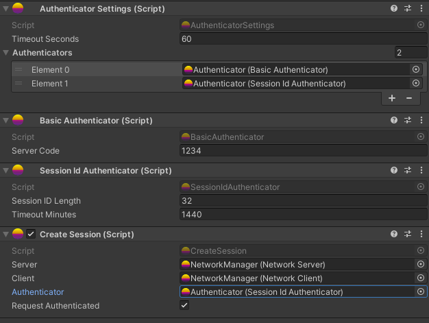

# Session Id Authenticator

Session Id Authenticator is a built in Authenticator that will allow clients to reconnect to a server without requiring them to fully authenticate again.

When using this you have 2 options, either use `CreateSession` component to automatically create and send session id. Or manually control it using `ClientIdStore` and `CreateOrRefreshSession()`.

Session id is only valid for a set amount of time, this can be set in the inspector and defaults to 1 day (1440 minutes).

## CreateSession component 

CreateSession will automatically send a message to the server if the client has valid session id when they connect. 

